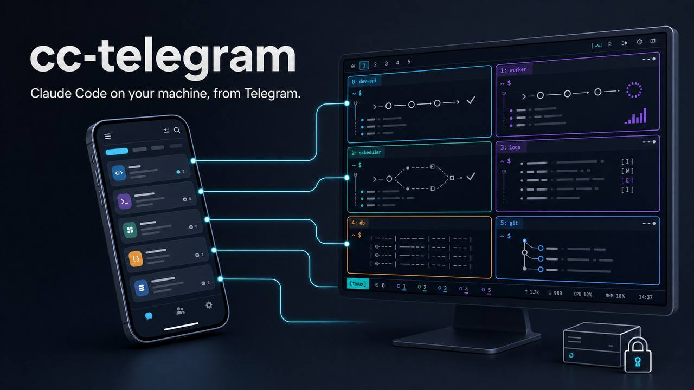

# cc-telegram



**Your real Claude Code, on your own machine, from Telegram.**

cc-telegram lets you use the Claude Code CLI from your phone without replacing it with a hosted chatbot or API wrapper.

It drives the `claude` process already running on your computer, inside tmux. That means Claude still has your files, tools, skills, MCP servers, and logged-in account. Telegram is simply the remote control.

Each topic in a Telegram forum maps to its own Claude Code session:

```text
Telegram topic  ↔  tmux window  ↔  Claude Code session
```

Open a topic to start a session. Switch topics to switch projects. Close Telegram and the work keeps running on your machine.

No web dashboard. No second agent runtime. No pretending a screenshot is an interactive prompt.

## Install it

### The easy way: ask Claude

If Claude Code is already installed, clone this repository, open it in Claude Code, and say:

```text
Read the README and set cc-telegram up for me.
```

Claude can install the package, create the config, add the hooks, run the checks, and set up the background service. It will only stop to ask for the two things it cannot create for you: your BotFather token and Telegram user ID.

### The manual way

You need:

- macOS or Linux. Windows works through WSL2; see [`docs/windows-wsl.md`](docs/windows-wsl.md).
- Python 3.12+, [`uv`](https://docs.astral.sh/uv/), and tmux.
- Claude Code installed, available as `claude`, and already logged in.
- A Telegram bot token from [@BotFather](https://t.me/BotFather).
- A Telegram supergroup with Topics enabled and your bot added.

Install cc-telegram:

```bash
git clone https://github.com/etcircle/cc-telegram.git
cd cc-telegram
uv tool install --force --no-cache .
```

`--no-cache` matters. The package version does not change on every deploy, so `uv tool install --force .` can quietly reinstall an old cached wheel while reporting success.

Create `~/.cc-telegram/.env`:

```env
TELEGRAM_BOT_TOKEN=your_bot_token_here
ALLOWED_USERS=your_telegram_user_id
```

Install the Claude Code hooks, check the setup, and start the bot:

```bash
cc-telegram hook --install
cc-telegram doctor
cc-telegram
```

Now send a message in a Telegram topic. The first message opens a directory picker so you can choose which project that topic should use.

For daily use on macOS, install the included LaunchAgent:

```bash
bash bin/install-service.sh
```

The full deployment and troubleshooting guide lives in [`docs/DEPLOYMENT.md`](docs/DEPLOYMENT.md). If you are sending a coding agent into the repository, point it at [`AGENTS.md`](AGENTS.md) first.

## Why this is useful

### One topic is one real session

Every Telegram topic owns a tmux window, and every tmux window contains a real Claude Code session. The forum becomes your session list. Several topics can use the same directory without getting their routing mixed up.

The terminal remains the source of truth. You can attach to tmux at any time and see the same session your phone is controlling.

### Interactive prompts are actually interactive

When Claude asks a question or presents a plan, cc-telegram turns it into a Telegram card with tappable choices.

A tap does not blindly send a number and hope for the best. The bot moves the live terminal cursor, verifies that it reached the intended option, and only then presses Enter. If the screen changed before your tap arrived, the action is cancelled instead of risking the wrong choice.

Permission and generic confirmation cards are enabled by default. Either detector can be disabled explicitly through its environment flag. Note that permission prompts are only *shown* — driving them from Telegram is impractical enough that Claude Code is normally run with permissions bypassed; see [Permissions](#permissions-in-practice-this-is-a-bypass-permissions-tool).

### You can tell what the machine is doing

Telegram's `typing…` indicator reflects real activity in the Claude session, including background agents, workflows, and shells.

If the foreground is quiet but background work is still running, the topic shows `⏳ Background work running`. If Claude is blocked and needs you, it posts a persistent `🔔 Claude needs a decision` card.

While a turn runs, a compact activity digest shows tool use, context pressure, and whether the session is busy or waiting. When the turn finishes, it collapses into a single line such as:

```text
✅ Done · repo · 14 tools · 2 sub-agents · 3m 41s
```

`/history` keeps the full detail when you need it.

### Files behave like files

If Claude mentions a local file such as `report.md` or `chart.png`, cc-telegram can turn it into a tap-to-download attachment. `/file <path>` fetches any supported file from the session's allowed directories, subject to a size limit.

Generated images appear as Telegram photos rather than terminal noise. `/screenshot` captures the current tmux pane as a PNG.

The file boundary is deliberately strict. cc-telegram only offers files that resolve under the session directory or an explicitly configured artifact root. Tool output, sub-agent narration, and web URLs cannot trick it into offering arbitrary paths.

### Telegram feels like a natural input surface

- Voice notes are transcribed and sent as prompts.
- Photos are passed to Claude as image blocks.
- Documents up to 20 MB are downloaded and forwarded.
- Replies include the quoted message with role-aware context.
- Unknown slash commands go straight to Claude Code, so `/clear`, `/compact`, `/model`, and `/effort` work from your phone.

### Messages are never typed into a live prompt

Every message, voice note, caption, attachment, and forwarded slash command goes
through one gate before it reaches the terminal. The bot delivers only on
positive proof that Claude Code is at its ready input box: the pane must show the
input row bracketed by its rule separators, the ready status chrome below it, no
autocomplete overlay, and Claude itself must be the process running in the pane.

That inversion matters because a blocking prompt *replaces* the input box. When
Claude is waiting on a question, a plan approval, a folder-trust prompt, a model
switch, or any prompt the bot has never seen before, the proof simply fails — and
your message is refused with an explanation instead of having its Enter key
commit the highlighted option for you.

Queueing while Claude is busy still works, and so do drafts you already typed in
the terminal — the gate checks for the input box, not for idleness. Messages that
are just a bare number are refused: the terminal reads a lone digit as a
keypress, not as text. So are messages carrying control characters — an escape
sequence, a tab, or a carriage return — because the terminal reads those as
*keypresses* (arrow keys, Tab, Enter) rather than as text, whatever the bot does
to type them. Ordinary line breaks are fine, so multi-line messages, voice notes
and quoted replies all deliver normally; a pasted snippet indented with literal
tabs is the one thing that gets turned away, with a note saying why. `/esc`, the
card buttons, and the arrow-key controls are deliberately *not* gated — those
exist to act on a live prompt.

If a message is refused, it is dropped with a notice naming the reason. Nothing
is ever replayed silently.

Because the bot types the text first and only then presses Enter, a prompt that
appears in between leaves your message sitting *unsent* in the terminal's input
box. When that happens you are told so, and the topic is braked: further messages
are refused until you clear the input box in the terminal (`Esc`, or `Ctrl+U`),
so the next message can never be appended to the stranded one and submit both at
once. `/esc` sends that Escape for you — but if Claude is mid-run it will also
interrupt the run. The brake lifts by itself as soon as the bot sees an empty
input box again. In the rarer case where the final Enter itself fails, the bot
says plainly that the message *may or may not* have been submitted — check the
window with `/screenshot` before resending.

### …but you can still answer a question card in your own words

Refusing everything would be a dead end, so the one prompt that *has* a free-text
option accepts one. Send a normal message — typed or a voice note — while a
**question card** (single-select) is on screen and it becomes your answer,
exactly as if you had picked "Type something." in the terminal.

**Replying to the card works too.** Swipe-reply to the question card and send a
voice note, and the quote goes along with your words — Claude gets the context
you were answering *and* the answer.

The bot does this by driving the terminal the same way the option buttons do: it
moves the cursor onto the card's free-text row, **proves it is standing on that
row and nowhere else**, types your message with the Enter withheld, re-checks the
card, and only then commits. That first proof is the important one. The free-text
row is the only row the terminal renders *dimmed* while it is selected and empty —
a real option never is — so if the cursor ends up anywhere but there, nothing is
typed at all and you get the ordinary refusal instead. **Your words can never
become an option pick.** If anything cannot be confirmed after the text is typed,
the Enter is withheld and you are told. Long messages are fine — a multi-paragraph
voice note is submitted whole.

**Which *question* you are answering is identified by the
`PreToolUse(AskUserQuestion)` hook** — Claude Code runs it *before* it draws the
picker, so the hook records which question is coming. The screen alone cannot do
this: two different questions can offer the same options, and the terminal shows
nothing that tells them apart. **Without that hook the lane simply declines** and
you get the ordinary refusal. `cc-telegram hook --install` installs it,
`cc-telegram doctor` reports it as missing, and the bot warns at startup.

**One honest limit.** If a question is answered elsewhere and Claude immediately
asks a *new* question **with the same options**, in the split second before the new
card is drawn, your message can land on the new question instead of the old one.
You will see it happen and can simply answer again. It cannot pick an option for
you — that is what the row proof above rules out — so the worst case is a misrouted
answer, not a decision made on your behalf. Everything else about the card — the
options, the buttons, the descriptions — works as usual.

**A plan approval is deliberately not answerable this way.** Its first option
reads *"Yes, and bypass permissions."*, every plan approval shows the same three
options, and Claude reuses one plan filename for the whole session (rewriting that
file in place each time it re-plans) — so neither the screen nor the file can tell
plan A from plan B. Identifying it safely would need its own hook and its own
state file, which is not a trade cc-telegram makes. A message sent at a plan
approval gets the ordinary refusal; approve, reject or amend it with the card's
buttons and keys.

Everything else keeps the refusal, on purpose: multi-select questions (their
answer takes several steps), folder-trust and model-switch prompts (no free-text
option exists), and anything carrying an attachment, a caption, or a slash command
— those are messages *about* something, not answers to the question. Cards say
which case you are looking at, so you are never guessing.

This is characterised per Claude Code version. On a version cc-telegram has not
verified, the free-text lane switches itself off and the card goes back to
buttons-and-refusal rather than trusting a stale assumption about the terminal.
Set `CC_TELEGRAM_FREE_TEXT_ANSWERS=false` to turn it off entirely.

### Sessions survive the boring failures

Claude runs in tmux, so closing Telegram, losing mobile signal, or restarting the bot does not kill the session. Routing and read positions are saved on disk and reconciled at startup.

Interactive actions use a restart-safe ledger. If Telegram retries a callback or you tap twice after a restart, cc-telegram will not submit the same choice twice.

There are more than 3,100 tests covering the bridge, including black-box scenarios for the user-visible behavior.

## Commands you will actually use

These commands belong to cc-telegram and are never forwarded to Claude:

| Command | What it does |
|---|---|
| `/start` | Show the short introduction and explain how to begin. |
| `/history` | Browse this topic's session history. |
| `/screenshot` | Capture the tmux pane as a PNG. |
| `/esc` | Send Escape to interrupt Claude. |
| `/usage` | Read Claude Code's usage and limits from the TUI overlay. If the session is busy, replies with a bridge-side snapshot (context usage plus cached limits) instead of a dead end. |
| `/cost` | Alias of `/usage` — same overlay, same busy-path snapshot. |
| `/update` | Update Claude Code and restart this topic's idle session in place; `/update all` restarts every idle session. Owner only. |
| `/dashboard` | Turn a topic into a live overview of all sessions; `/dashboard pin` pins it. |
| `/settings` | Change your output verbosity and display preferences. |
| `/file <path>` | Upload a file from the session's allowed directories. Spaces are fine. |
| `/unbind` | Detach the topic without killing its tmux window. |
| `/kill` | Kill the topic's tmux window while leaving the topic available for a new session. |

Every other slash command is forwarded to Claude Code. `/help` and `/memory` are the exceptions worth knowing about: they open interactive Claude panels that do not reach the transcript, so they are not useful through the bridge.

## More of what it handles

- **Independent queues.** Each `(user, topic, window)` route has its own worker, so a noisy session cannot stall another topic.
- **Streaming output.** Assistant text, thinking, tool summaries, prompts, and local command output appear as they happen.
- **Live explanations before questions.** A scoped MessageDisplay hook can show Claude's explanation before an AskUserQuestion or ExitPlanMode picker, even when Claude Code would normally buffer that prose until after your answer.
- **Late answers.** Recent Claude Code versions may auto-resolve unanswered prompts after about 60 seconds. cc-telegram changes the card to explain what happened and lets you send your choice as a correction.
- **Personal output settings.** `/settings` offers verbose, standard, compact, and quiet presets. Preferences are stored per user.
- **Broken-topic fallback.** If Telegram reports that a topic was removed, closed, or forbidden, output falls back to DM instead of disappearing.
- **Approval cards.** Permission prompts and generic decisions are surfaced as cards by default. Verified one-tap dispatch is limited to prompt families and Claude Code versions that cc-telegram has explicitly characterised; everything else is display-only with raw keystroke controls. See [Permissions: in practice this is a bypass-permissions tool](#permissions-in-practice-this-is-a-bypass-permissions-tool).

## Single-user by design

cc-telegram connects one person's Telegram account to that person's machine. Set `ALLOWED_USERS` to your own Telegram user ID and treat the bot as remote access to your Claude Code environment.

This is not a multi-tenant bot platform. If several people need separate environments, give each person a separate instance and machine boundary.

## Run from source

For development, create the repository virtual environment instead of installing the tool globally:

```bash
git clone https://github.com/etcircle/cc-telegram.git
cd cc-telegram
uv sync --all-extras
```

Then prefix commands with `uv run`:

```bash
uv run cc-telegram doctor
uv run cc-telegram
```

---

# Operator reference

Everything below is the detailed reference for configuration, state, hooks, deployment, and development.

## Configuration

The two required values live in `~/.cc-telegram/.env`:

```env
TELEGRAM_BOT_TOKEN=your_bot_token_here
ALLOWED_USERS=your_telegram_user_id
```

Everything else has a default.

### Core variables

| Variable | Purpose |
|---|---|
| `TELEGRAM_BOT_TOKEN` | Required. Telegram bot token from BotFather. |
| `ALLOWED_USERS` | Required. Comma-separated Telegram user IDs. |
| `CC_TELEGRAM_DIR` | Config and state directory. Default: `~/.cc-telegram`. |
| `TMUX_SESSION_NAME` | tmux session controlled by the bot. Default: `cc-telegram`. |
| `CLAUDE_COMMAND` | Command used for new windows. Default: `claude`. It must exec the Claude binary directly, or use an exec-ing wrapper. |
| `CLAUDE_CONFIG_DIR` | Claude config root. Projects default to `$CLAUDE_CONFIG_DIR/projects`. |
| `CC_TELEGRAM_CLAUDE_PROJECTS_PATH` | Explicit Claude projects directory. Precedence: this variable, then `CLAUDE_CONFIG_DIR/projects`, then `~/.claude/projects`. |
| `MONITOR_POLL_INTERVAL` | JSONL poll interval in seconds. Default: `2.0`. |
| `CC_TELEGRAM_BROWSE_ROOT` | Root shown by the directory picker. Default: `~`. |
| `OPENAI_API_KEY` / `OPENAI_BASE_URL` | Optional voice-transcription provider. |

### Display and behavior

- `CC_TELEGRAM_VERBOSITY` sets the initial output preset for users who have not chosen one through `/settings`. Accepted values: `verbose`, `standard`, `compact`, or `quiet`. Default: `standard`.
- `CC_TELEGRAM_SHOW_USER_MESSAGES` controls whether messages seen in tmux are echoed back. An explicit value becomes the default for each user's echo preference.
- `CC_TELEGRAM_SHOW_TOOL_CALLS` controls display of tool activity, including sub-agent cards. Hiding it does not stop transcript tracking or busy-state detection.
- `CC_TELEGRAM_SHOW_HIDDEN_DIRS` shows dot-directories in the picker when true. Default: false.
- `CC_TELEGRAM_HOOK_TIMEOUT` changes how long the bot waits for Claude's SessionStart hook. The built-in defaults are 5 seconds for fresh sessions and 15 seconds for resumed sessions. This is useful on slow WSL mounts or when several MCP servers delay startup.
- `CC_TELEGRAM_WINDOW_GEOMETRY` sets the tmux geometry used by the parser. Default: `160x50`; accepted bounds are 20–500 columns and 5–300 rows.
- `CC_TELEGRAM_PERMISSION_PROMPTS` surfaces tool permission prompts and Workflow launch gates as Telegram cards. Default: true (set `CC_TELEGRAM_PERMISSION_PROMPTS=false` to disable).
- `CC_TELEGRAM_DECISION_CARDS` surfaces otherwise unsupported numbered confirmation prompts as display-only cards. Default: true (set `CC_TELEGRAM_DECISION_CARDS=false` to disable).
- `CC_TELEGRAM_DECISION_DISPATCH` enables verified one-tap dispatch for known-good decision families when decision cards are also enabled. Unknown prompts and uncharacterised Claude versions remain display-only.
- `CC_TELEGRAM_FREE_TEXT_ANSWERS` lets a plain message (typed or voice, including a swipe-reply that quotes the card) answer a live question card in your own words, by driving the card's free-text row. Default: true (set `CC_TELEGRAM_FREE_TEXT_ANSWERS=false` to fall back to refusing those messages). Limited to Claude Code versions cc-telegram has characterised; an uncharacterised version disables the lane by itself. It also requires the `PreToolUse(AskUserQuestion)` hook, because that hook is what identifies *which* question you are answering. Without it, those messages are refused rather than delivered. Plan approvals are deliberately not covered. See [you can still answer a question card in your own words](#but-you-can-still-answer-a-question-card-in-your-own-words).
- `CC_TELEGRAM_ARTIFACT_MAX_MB` sets the maximum upload size for attachment cards and `/file`. Default: 45 MB; Telegram's bot limit is 50 MB.
- `CC_TELEGRAM_ARTIFACT_ROOTS` adds comma-separated absolute directories that may serve files in addition to the active session directory.
- `CC_TELEGRAM_TOOL_SUMMARY_MAX_CHARS` limits the input preview shown in tool lines. Default: 40.
- `CC_TELEGRAM_AGENT_PROMPT_PREVIEW_CHARS` limits sub-agent dispatch previews. Default: 400.
- `CC_TELEGRAM_REPLY_CONTEXT` enables reply and quote injection. Default: true.
- `CC_TELEGRAM_REPLY_CROSS_SESSION` annotates replies to messages from an earlier Claude session instead of dropping them. Default: true.
- `CC_TELEGRAM_QUOTE_INJECTION_MAX_CHARS` caps quoted text sent to Claude. Default: 1600.
- `CC_TELEGRAM_AGGREGATOR_DEBOUNCE_SECONDS` sets the media and caption coalescing window. Default: 1.5.
- `CC_TELEGRAM_AGGREGATOR_MAX_ATTACHMENTS` limits each inbound attachment bundle. Default: 10.
- `CC_TELEGRAM_MAX_ATTACHMENT_SIZE_BYTES` caps downloaded documents. Default: 20,971,520 bytes.
- `CC_TELEGRAM_CONTEXT_PCT_THRESHOLD` sets the context warning threshold. Default: 80.
- `CC_TELEGRAM_CONTEXT_IN_MESSAGE_FOOTER` adds context usage to turn footers. Default: true.
- `CC_TELEGRAM_MESSAGE_REFS_RETENTION_DAYS` sets provenance retention. Default: 30 days.
- `CC_TELEGRAM_MESSAGE_REFS_DB_PATH` overrides the SQLite provenance database path.
- `CC_TELEGRAM_MESSAGE_REF_TEXT_MAX_CHARS` caps stored message bodies. Default: 4000.

Per-user `/settings` choices take precedence over environment defaults.

### Permissions: in practice this is a bypass-permissions tool

cc-telegram is realistically run with `--dangerously-skip-permissions`, and you should decide up front whether that trade is acceptable to you.

The reason is structural. Claude Code's tool-permission prompts are a terminal UI, and the bridge can only reproduce them as a card with raw keystroke controls — there is no verified one-tap dispatch for them, so approving a `Bash` or `Edit` call from your phone means sending un-cursor-verified arrow keys into a live terminal. In day-to-day use that is slow enough that a permission-prompting session is impractical to drive over Telegram at all. Running Claude Code with permissions bypassed is therefore the normal configuration, not an optimisation.

What that means for your security boundary: it is no longer Claude Code's per-tool approval. It is **`ALLOWED_USERS` plus the machine you run on**. Anyone who can post in your forum can make Claude read, edit, and execute anything your user account can. Lock `ALLOWED_USERS` to your own Telegram user ID, run on a machine you trust, and consider `IS_SANDBOX=1`.

> **Sending while a prompt is on screen (GH #50).** This used to be a live hazard: a plain text message sent while Claude was waiting on a question card, a plan approval, or a folder-trust dialog was typed into the terminal, where the text was discarded and the trailing Enter committed the highlighted option (on a plan approval, that meant approving the plan). The delivery gate now refuses those sends with an explanation instead — see [Messages are never typed into a live prompt](#messages-are-never-typed-into-a-live-prompt). On a single-select **question card**, your message is instead delivered *into* its free-text option as the answer; see [you can still answer a question card in your own words](#but-you-can-still-answer-a-question-card-in-your-own-words). Everywhere else — plan approvals included: answer the card first, then send your message.

### Suggested daily-driver config

Only use `--dangerously-skip-permissions` on a machine you trust, with `ALLOWED_USERS` locked to you.

```env
TELEGRAM_BOT_TOKEN=...
ALLOWED_USERS=<your_id>
CLAUDE_COMMAND=IS_SANDBOX=1 claude --dangerously-skip-permissions
MONITOR_POLL_INTERVAL=1.0
OPENAI_API_KEY=sk-...
CC_TELEGRAM_BROWSE_ROOT=~/dev
# CC_TELEGRAM_SHOW_TOOL_CALLS=false
# CC_TELEGRAM_SHOW_USER_MESSAGES=false
```

### Use a different config directory

```bash
CC_TELEGRAM_DIR=/path/to/state cc-telegram
```

This is useful for testing or running several isolated profiles from one installation.

## How `/update` behaves

`/update` updates the Claude Code CLI, then restarts the invoking topic's idle session inside its existing tmux window using `claude --resume`. Topic bindings and tmux window IDs stay intact. `/update all` does the same across every bound topic (the fleet walk).

The default is scoped to one topic on purpose: restarting an idle session revives it, and a revived session is not free, so dormant topics stay dormant unless you explicitly ask.

The command is owner-only and deliberately conservative:

- Busy, waiting, background-agent, and background-shell sessions are deferred rather than interrupted.
- Sessions that do not exit cleanly within roughly 15 seconds are skipped, not force-killed.
- A skipped window is quarantined. The bot refuses to type into it until it can prove that Claude is running again. This prevents a message intended for Claude from being executed by a bare shell.
- Restarts happen one at a time. A second `/update` is rejected while the first is running.
- There is no automatic scheduler. Run `/update` when you want active sessions moved onto a newly installed CLI version.
- The scoped form re-checks the topic's binding after the CLI update, so it still targets the right window if the topic was rebound while the update ran.

A typical `/update all` result looks like:

```text
♻️ Restarted 4 idle · deferred 2 busy · skipped 0
```

`CLAUDE_COMMAND` must exec the Claude binary directly. A non-exec shell wrapper keeps the wrapper shell as the pane's foreground process, so the bot cannot tell a live Claude apart from a bare shell. That breaks the `/update` safety checks in the dangerous direction, and it makes the message-delivery gate refuse every message ("Claude isn't running in this window"). The bot logs a loud warning at startup when it detects this shape.

## State files

cc-telegram stores state under `$CC_TELEGRAM_DIR`, which defaults to `~/.cc-telegram/`.

| Path | What it contains |
|---|---|
| `state.json` | Topic bindings, window state, display names, read offsets, dashboard hosts, and per-user settings. |
| `session_map.json` | SessionStart-hook mapping from tmux window ID to Claude session. |
| `monitor_state.json` | Incremental JSONL read offsets. |
| `interactive_state.json` | Persisted interactive message IDs and AskUserQuestion context. |
| `auq_pending/<session_id>.json` | Structured AskUserQuestion input captured by PreToolUse. Files are mode `0600` under a `0700` directory. |
| `notify_pending/<session_id>.json` | Window-keyed marker showing that Claude is waiting for approval or input. It stores no notification message text. |
| `auq_action_ledger.jsonl` | Restart-safe action ledger that prevents duplicate option submissions. |
| `pick_intent.jsonl` | Recovery data for the first tap on an AskUserQuestion card after a bot restart. |
| `md_hook_settings.json` | Bot-managed MessageDisplay settings passed only to bot-created Claude sessions. |
| `msg_display/<session_id>.ndjson` | Live prose captured by MessageDisplay before a prompt resolves, plus same-lifecycle `shown_live`/`consumed`, `surface_floor`, and `recap_shown` marker lines. |
| `images/` and `files/` | Downloaded Telegram attachments. Directories use mode `0700`; files use `0600`. |
| `message_refs.db` | SQLite provenance index used for safe reply-context resolution. |
| `log-archive/` | Compressed rotated launchd logs, when the rotation agent is installed. |

The bot recreates these files as needed. Deleting them also deletes the state they represent, including topic bindings and interactive continuity.

## Claude Code hooks

Install or repair the managed hooks with:

```bash
cc-telegram hook --install
```

This updates `~/.claude/settings.json` with three entries:

```json
{
  "hooks": {
    "SessionStart": [
      {
        "hooks": [
          { "type": "command", "command": "cc-telegram hook", "timeout": 5 }
        ]
      }
    ],
    "PreToolUse": [
      {
        "matcher": "AskUserQuestion",
        "hooks": [
          { "type": "command", "command": "cc-telegram hook", "timeout": 2 }
        ]
      }
    ],
    "Notification": [
      {
        "hooks": [
          { "type": "command", "command": "cc-telegram hook", "timeout": 2 }
        ]
      }
    ]
  }
}
```

The hooks have separate jobs:

- `SessionStart` writes `session_map.json` so messages return to the right tmux window.
- `PreToolUse` captures the structured AskUserQuestion payload before Claude renders its picker. It is also what tells one question apart from another, so **without it a plain message sent at a question card is refused rather than delivered as the answer** — see [you can still answer a question card in your own words](#but-you-can-still-answer-a-question-card-in-your-own-words).
- `Notification` records that Claude is blocked on an approval prompt that may never appear in the session JSONL.

`cc-telegram doctor` verifies all three managed hooks. A missing SessionStart
hook retains the existing health-check severity; missing PreToolUse or
Notification hooks are reported as warnings. Repair any missing entry with
`cc-telegram hook --install`.

## AskUserQuestion cards

Claude Code does not expose option descriptions in the terminal transcript until after an AskUserQuestion resolves. The PreToolUse hook captures the original tool input in:

```text
$CC_TELEGRAM_DIR/auq_pending/<session_id>.json
```

This lets Telegram show the full descriptions before you choose.

For a single-choice question, cc-telegram navigates the live terminal with arrow keys and commits with Enter. It verifies the cursor position and checks that the form advanced. If the move fails before Enter, the tap remains retryable. If Enter was sent but the result cannot be confirmed, the action is marked `commit_unconfirmed` and will not be submitted again automatically.

Multi-select questions use digit toggles, followed by the review screen's Submit or Cancel action. Their pending side file stays alive until the final tool result resolves the question. On current Claude Code versions a digit *toggles* a checkbox on a multi-select screen but *commits* on a single-select one, which is exactly why single-choice picks never send a bare digit — and why a Telegram message that is nothing but a number is refused rather than typed.

The action ledger survives bot restarts, so duplicated Telegram callbacks do not repeat a committed choice.

## Live prose before a question

Claude Code can buffer an explanation and its interactive prompt together, which means the explanation normally appears only after you answer.

cc-telegram works around this with Claude Code's MessageDisplay hook. The bot writes a scoped settings file and passes it only to Claude sessions that it launches:

```text
$CC_TELEGRAM_DIR/md_hook_settings.json
```

The hook appends streaming deltas to:

```text
$CC_TELEGRAM_DIR/msg_display/<session_id>.ndjson
```

The bot assembles and posts the explanation before the picker, then suppresses the duplicate copy when the resolved transcript arrives. Capture files are removed after resolution, session replacement, `/clear`, or topic closure, with startup garbage collection as a backstop.

If an AskUserQuestion explanation is too old for the normal emission-anchor
window but can still be proven to belong to the current delivered turn, the bot
re-surfaces it immediately before the question as `📌 Context (recap)`. Each AUQ
surface records a frozen predecessor floor in the same NDJSON file so findings
from one question cannot leak into a chained question. Recaps are best-effort,
normally once, and disabled by the quiet output preset. After a bot restart the
in-memory turn boundary is unavailable, so recap fails closed; the question card
still appears and the transcript remains the fallback delivery path.

No global MessageDisplay hook is installed in `~/.claude/settings.json`.

## Voice transcription

Voice notes use an OpenAI-compatible transcription endpoint:

```text
POST $OPENAI_BASE_URL/audio/transcriptions
Authorization: Bearer $OPENAI_API_KEY
```

The transcription model is currently fixed to `gpt-4o-transcribe`. Your backend must expose that exact model name or translate it to one it supports.

Each HTTP attempt has a real end-to-end deadline derived from Telegram's
advisory voice duration: twice the note length, with a 120-second floor and a
600-second ceiling. Missing, invalid, or implausible duration metadata uses the
120-second floor. The same budget is also passed as the request timeout, so
five-to-six-minute voice notes can finish without removing the overall bound.

The bot retries at most once, and only when it can avoid blindly repeating a
possibly completed paid request: a connection failure before upload, or an HTTP
429 that explicitly declined the request. For 429 responses, integer
`Retry-After` delays from 0 through 10 seconds are honored; a missing header uses
1.5 seconds, while longer or malformed values are not retried. Read/write
timeouts, other transport failures, other 4xx responses, 5xx responses, and
empty transcriptions are never retried.

At INFO level, voice processing logs receipt metadata (`duration_s`, byte count,
and topic thread), successful latency plus transcription length, or a classified
failure. Transcription text is never written to logs. If the optional Telegram
echo fails after the turn has been offered to Claude, the failure is WARNING
logged without dropping the turn.

Examples of suitable backends include:

- `https://api.openai.com/v1`
- a local LiteLLM or vLLM gateway
- another OpenAI-compatible service that exposes `gpt-4o-transcribe`

A whisper.cpp server that only provides `/inference`, or a service that only exposes `whisper-1`, needs a small shape and model-name translating proxy.

Without `OPENAI_API_KEY`, the bot explains that transcription is unavailable and makes no HTTP request.

## Run as a macOS service

Install the bundled LaunchAgent after `cc-telegram` is on `PATH`:

```bash
bash bin/install-service.sh
```

Preview the generated plist without loading it:

```bash
bash bin/install-service.sh --print
```

The service label is `com.cc-telegram`. Restart it with:

```bash
launchctl kickstart -k gui/$(id -u)/com.cc-telegram
```

The installer sets an explicit `PATH`, enables `KeepAlive` and `RunAtLoad`, and writes logs to:

```text
$CC_TELEGRAM_DIR/launchd.out.log
$CC_TELEGRAM_DIR/launchd.err.log
```

## Log rotation

launchd owns the two log files above, so the Python process cannot rotate them itself. Install the companion rotation agent:

```bash
bash bin/install-log-rotate.sh
```

Every 30 minutes it checks both files. If either exceeds 50 MB, it writes a dated gzip archive under `~/.cc-telegram/log-archive/` and truncates the original file in place. Archives older than 14 days are removed.

Run a rotation pass immediately:

```bash
launchctl kickstart gui/$(id -u)/com.cc-telegram.log-rotate
```

Uninstall it with:

```bash
launchctl bootout gui/$(id -u)/com.cc-telegram.log-rotate
rm ~/Library/LaunchAgents/com.cc-telegram.log-rotate.plist
```

The thresholds can be changed through `CC_TELEGRAM_LOG_ROTATE_THRESHOLD_MB` and `CC_TELEGRAM_LOG_ROTATE_MAX_AGE_DAYS` in the plist's environment block.

## Tests

```bash
uv run ruff format src/ tests/
uv run ruff check src/ tests/
uv run pyright src/cctelegram/
uv run pytest --tb=short -q
uv run pytest -m scenario -q
bin/post-wave-check.sh
```

`tests/scenarios/` is the black-box behavior floor. Each scenario drives a user-visible workflow through the real handler stack rather than monkeypatching handler internals. See [`tests/scenarios/README.md`](tests/scenarios/README.md) for the behavior map.

## Repository map

```text
src/cctelegram/                         core package
src/cctelegram/handlers/                Telegram interaction layer
  attention.py                          end-of-turn attention cards
  inbound_aggregator.py                 caption/media/photo bundling
  reply_context.py                      Telegram reply context
  message_queue.py                      per-route FIFO workers
  message_sender.py                     safe send/edit/delete handling
  output_prefs.py                       per-user output settings
  artifacts.py                          validated file downloads and /file
  status_polling.py                     polling and typing state
  interactive_ui.py                     question, plan, and permission cards
  notify_source.py                      waiting-on-you hook markers
  dashboard.py                          cross-topic dashboard
  updater.py                            /update and in-place restarts
  directory_browser.py                  project and session picker
  history.py                            /history paginator
  cleanup.py                            topic teardown
src/cctelegram/delivery.py              delivery result, refusal copy, payload shaping
src/cctelegram/message_refs.py          SQLite message provenance
src/cctelegram/session_monitor.py       Claude JSONL tailer
src/cctelegram/transcript_parser.py     JSONL event parser
src/cctelegram/route_runtime.py         route run-state authority
src/cctelegram/transcript_event_adapter.py
                                          transcript-to-runtime adapter
src/cctelegram/md_capture.py            MessageDisplay reader and dedup
src/cctelegram/_md_display_appender.py  tiny standalone hook appender
src/cctelegram/rate_limiter.py          Telegram-aware rate limiter
tests/                                  pytest suite
tests/scenarios/                        black-box behavior floor
bin/post-wave-check.sh                  repository health diff
bin/install-service.sh                  macOS LaunchAgent installer
bin/install-log-rotate.sh               log rotation installer
.claude/rules/                          architecture notes for Claude Code
docs/DEPLOYMENT.md                      deploy and troubleshooting guide
docs/windows-wsl.md                     Windows and WSL2 setup
AGENTS.md                               coding-agent orientation
CLAUDE.md                               build, test, and architecture rules
```

## License

MIT. See [`LICENSE`](LICENSE).
